Software Usage Promotion Campaign Uplift Modeling
================
Martin MacFarlane
Sept 10, 2024

Initial data exploration was done in “Software Usage Promotion
Campaign.ipynb” and exported to “multi_attribution_update.csv”.

\#import libraries

``` r
library(cobalt)
library(WeightIt)
library(lmtest)
library(sandwich)
library(knitr)
library(ggplot2)
library(rmarkdown)
library(dplyr)
library(tidyverse)
```

``` r
# Load file as dataframe
df <- read.csv("multi_attribution_update.csv")
```

``` r
# inspect dataframe
print(head(df))
```

    ##   global major smc commercial it_spend employee_count pc_count   size
    ## 1      1     0   1          0    45537             26       26 152205
    ## 2      0     0   1          1    20842            107       70 159038
    ## 3      0     0   0          1    82171             10        7 264935
    ## 4      0     0   0          0    30288             40       39  77522
    ## 5      0     0   1          0    25930             37       43  91446
    ## 6      0     0   1          0    34597             44       51 218703
    ##   tech_support discount  revenue tech_discount
    ## 1            0        1 17688.36             0
    ## 2            0        1 14981.44             0
    ## 3            1        1 32917.14             1
    ## 4            1        1 14773.77             1
    ## 5            1        1 17098.70             1
    ## 6            1        0 17280.71             0

``` r
# Inspect the data
str(df)
```

    ## 'data.frame':    2000 obs. of  12 variables:
    ##  $ global        : int  1 0 0 0 0 0 1 0 0 0 ...
    ##  $ major         : int  0 0 0 0 0 0 0 0 0 0 ...
    ##  $ smc           : int  1 1 0 0 1 1 0 1 0 1 ...
    ##  $ commercial    : int  0 1 1 0 0 0 0 1 1 1 ...
    ##  $ it_spend      : int  45537 20842 82171 30288 25930 34597 40199 30454 23428 7970 ...
    ##  $ employee_count: int  26 107 10 40 37 44 21 11 50 131 ...
    ##  $ pc_count      : int  26 70 7 39 43 51 14 8 55 153 ...
    ##  $ size          : int  152205 159038 264935 77522 91446 218703 126342 96784 77298 77888 ...
    ##  $ tech_support  : int  0 0 1 1 1 1 0 0 1 1 ...
    ##  $ discount      : int  1 1 1 1 1 0 0 0 1 1 ...
    ##  $ revenue       : num  17688 14981 32917 14774 17099 ...
    ##  $ tech_discount : int  0 0 1 1 1 0 0 0 1 1 ...

``` r
summary(df)
```

    ##      global          major            smc           commercial   
    ##  Min.   :0.000   Min.   :0.000   Min.   :0.0000   Min.   :0.000  
    ##  1st Qu.:0.000   1st Qu.:0.000   1st Qu.:0.0000   1st Qu.:0.000  
    ##  Median :0.000   Median :0.000   Median :1.0000   Median :1.000  
    ##  Mean   :0.202   Mean   :0.195   Mean   :0.5045   Mean   :0.691  
    ##  3rd Qu.:0.000   3rd Qu.:0.000   3rd Qu.:1.0000   3rd Qu.:1.000  
    ##  Max.   :1.000   Max.   :1.000   Max.   :1.0000   Max.   :1.000  
    ##     it_spend      employee_count      pc_count           size       
    ##  Min.   :  1161   Min.   : 10.00   Min.   :  6.00   Min.   : 10101  
    ##  1st Qu.:  8914   1st Qu.: 24.00   1st Qu.: 22.00   1st Qu.: 39282  
    ##  Median : 19210   Median : 44.00   Median : 41.00   Median : 81378  
    ##  Mean   : 28273   Mean   : 61.12   Mean   : 57.35   Mean   :113159  
    ##  3rd Qu.: 37992   3rd Qu.: 79.00   3rd Qu.: 74.00   3rd Qu.:155635  
    ##  Max.   :259808   Max.   :535.00   Max.   :407.00   Max.   :766485  
    ##   tech_support      discount         revenue        tech_discount  
    ##  Min.   :0.000   Min.   :0.0000   Min.   : -616.6   Min.   :0.000  
    ##  1st Qu.:0.000   1st Qu.:0.0000   1st Qu.: 7545.1   1st Qu.:0.000  
    ##  Median :1.000   Median :1.0000   Median :12582.4   Median :0.000  
    ##  Mean   :0.503   Mean   :0.5105   Mean   :15397.9   Mean   :0.272  
    ##  3rd Qu.:1.000   3rd Qu.:1.0000   3rd Qu.:19663.0   3rd Qu.:1.000  
    ##  Max.   :1.000   Max.   :1.0000   Max.   :86006.9   Max.   :1.000

Defining 3 separate treatment variables: “tech_support”, “discount”
“tech_discount”. The latter which will combine the effect of both
tech_support and discount on the outcome variable “revenue”.

``` r
# Define treatment and outcome
treatment1 <- df$tech_support
treatment2 <- df$discount
treatment3 <- df$tech_discount
outcome <- df$revenue
```

Creating balance tables for the 3 treatment variables to obtain the
standardized mean difference and variance ratio for each treatment. SMD
values should be +/- 0.1 and Variance Ratio values should be between
0.5 - 2. The treatment and control groups are not well balanced and
weighting will be needed.

``` r
# Balance table to show SMD and variance ratio between groups

print("Balance Table for Tech Support")
```

    ## [1] "Balance Table for Tech Support"

``` r
bal.tab(
    x = treatment1 ~ global + major + smc + commercial + it_spend + employee_count,
    data = df,
    binary = "std",
    disp.v.ratio = TRUE   
)
```

    ## Balance Measures
    ##                   Type Diff.Un V.Ratio.Un
    ## global          Binary  0.0588          .
    ## major           Binary  0.0952          .
    ## smc             Binary -0.0381          .
    ## commercial      Binary -0.1047          .
    ## it_spend       Contin.  0.5257     2.5583
    ## employee_count Contin.  0.0552     0.9630
    ## 
    ## Sample sizes
    ##     Control Treated
    ## All     994    1006

``` r
print("Balance Table for Discount")
```

    ## [1] "Balance Table for Discount"

``` r
bal.tab(
    x = treatment2 ~ global + major + smc + commercial + it_spend + employee_count,
    data = df,
    binary = "std",
    disp.v.ratio = TRUE,
)
```

    ## Balance Measures
    ##                   Type Diff.Un V.Ratio.Un
    ## global          Binary -0.0012          .
    ## major           Binary -0.0712          .
    ## smc             Binary -0.0164          .
    ## commercial      Binary -0.0109          .
    ## it_spend       Contin.  0.3795     1.6389
    ## employee_count Contin.  0.0304     1.0139
    ## 
    ## Sample sizes
    ##     Control Treated
    ## All     979    1021

``` r
print("Balance Table for Tech Support and Discount")
```

    ## [1] "Balance Table for Tech Support and Discount"

``` r
bal.tab(
    x = treatment3 ~ global + major + smc + commercial + it_spend + employee_count,
    data = df,
    binary = "std",
    disp.v.ratio = TRUE,
)
```

    ## Balance Measures
    ##                   Type Diff.Un V.Ratio.Un
    ## global          Binary  0.0568          .
    ## major           Binary  0.0186          .
    ## smc             Binary -0.0831          .
    ## commercial      Binary -0.0593          .
    ## it_spend       Contin.  0.6089     2.0987
    ## employee_count Contin.  0.0545     0.9859
    ## 
    ## Sample sizes
    ##     Control Treated
    ## All    1456     544

Perform the inverse probability of treatment weighting (IPTW) procedure
for each treatment to see if we can minimize imbalance between the
treatment groups before estimating the causal treatment effect.

``` r
# create propensity scores with WeightIt
weight1 <- weightit(treatment1 ~ global + major + smc + commercial + it_spend + employee_count, data = df, method = "ps", estimand = "ate")

weight2 <- weightit(treatment2 ~ global + major + smc + commercial + it_spend + employee_count, data = df, method = "ps", estimand = "ate")

weight3 <- weightit(treatment3 ~ global + major + smc + commercial + it_spend + employee_count, data = df, method = "ps", estimand = "ate")
```

``` r
# check the summary
summary(weight1)
```

    ##                   Summary of weights
    ## 
    ## - Weight ranges:
    ## 
    ##            Min                                   Max
    ## treated 1.0050 ||                             3.1738
    ## control 1.4454 |---------------------------| 30.8375
    ## 
    ## - Units with the 5 most extreme weights by group:
    ##                                             
    ##             247    269   1634    147     913
    ##  treated 3.1126 3.1155 3.1209 3.1274  3.1738
    ##             607    893    522   1867    1005
    ##  control 7.2866 8.4219 8.5759 9.9381 30.8375
    ## 
    ## - Weight statistics:
    ## 
    ##         Coef of Var   MAD Entropy # Zeros
    ## treated       0.250 0.210   0.032       0
    ## control       0.595 0.236   0.082       0
    ## 
    ## - Effective Sample Sizes:
    ## 
    ##            Control Treated
    ## Unweighted  994.      1006
    ## Weighted    734.17     947

``` r
summary(weight2)
```

    ##                   Summary of weights
    ## 
    ## - Weight ranges:
    ## 
    ##            Min                                   Max
    ## treated 1.0355 ||                             2.6579
    ## control 1.6036  |--------------------------| 18.2993
    ## 
    ## - Units with the 5 most extreme weights by group:
    ##                                              
    ##            1602   1757   1800    1807     803
    ##  treated 2.6096 2.6255 2.6284  2.6288  2.6579
    ##              66    150   1005    1293    1454
    ##  control 8.1502 8.6947 9.3839 11.8644 18.2993
    ## 
    ## - Weight statistics:
    ## 
    ##         Coef of Var   MAD Entropy # Zeros
    ## treated       0.172 0.142   0.015       0
    ## control       0.421 0.172   0.050       0
    ## 
    ## - Effective Sample Sizes:
    ## 
    ##            Control Treated
    ## Unweighted  979.   1021.  
    ## Weighted    831.79  991.77

``` r
summary(weight3)
```

    ##                   Summary of weights
    ## 
    ## - Weight ranges:
    ## 
    ##            Min                                   Max
    ## treated 1.0196 |-------|                      6.6006
    ## control 1.1704 |---------------------------| 19.0889
    ## 
    ## - Units with the 5 most extreme weights by group:
    ##                                              
    ##             635    684   1541     811    1511
    ##  treated 6.2645 6.4481 6.5325  6.5391  6.6006
    ##             150     66   1005    1293    1454
    ##  control 6.4562 6.5419 9.1198 10.1732 19.0889
    ## 
    ## - Weight statistics:
    ## 
    ##         Coef of Var   MAD Entropy # Zeros
    ## treated       0.375 0.317   0.073       0
    ## control       0.482 0.157   0.053       0
    ## 
    ## - Effective Sample Sizes:
    ## 
    ##            Control Treated
    ## Unweighted 1456.       544
    ## Weighted   1181.49     477

The weighted summary statisics seem reasonable as does the adjusted size
of the control and treated groups. We’ll now re-check the SMC and
variance ratio of the weighted groups.

``` r
# check balance using cobalt
print("Balance Table for Tech Support")
```

    ## [1] "Balance Table for Tech Support"

``` r
bal.tab(
    weight1,
    data = df,
    binary = "std",
    disp.v.ratio = TRUE)
```

    ## Balance Measures
    ##                    Type Diff.Adj V.Ratio.Adj
    ## prop.score     Distance  -0.0383      0.8256
    ## global           Binary  -0.0260           .
    ## major            Binary   0.0178           .
    ## smc              Binary  -0.0276           .
    ## commercial       Binary   0.0083           .
    ## it_spend        Contin.  -0.0593      0.7613
    ## employee_count  Contin.  -0.0005      0.8063
    ## 
    ## Effective sample sizes
    ##            Control Treated
    ## Unadjusted  994.      1006
    ## Adjusted    734.17     947

``` r
print("Balance Table for Discount")
```

    ## [1] "Balance Table for Discount"

``` r
bal.tab(
    weight2,
    data = df,
    binary = "std",
    disp.v.ratio = TRUE)
```

    ## Balance Measures
    ##                    Type Diff.Adj V.Ratio.Adj
    ## prop.score     Distance  -0.0618      0.6918
    ## global           Binary  -0.0007           .
    ## major            Binary   0.0104           .
    ## smc              Binary  -0.0165           .
    ## commercial       Binary  -0.0032           .
    ## it_spend        Contin.  -0.1031      0.5308
    ## employee_count  Contin.   0.0137      0.9846
    ## 
    ## Effective sample sizes
    ##            Control Treated
    ## Unadjusted  979.   1021.  
    ## Adjusted    831.79  991.77

``` r
print("Balance Table for Tech Support and Discount")
```

    ## [1] "Balance Table for Tech Support and Discount"

``` r
bal.tab(
    weight3,
    data = df,
    binary = "std",
    disp.v.ratio = TRUE)
```

    ## Balance Measures
    ##                    Type Diff.Adj V.Ratio.Adj
    ## prop.score     Distance  -0.0542      0.5739
    ## global           Binary  -0.0011           .
    ## major            Binary   0.0262           .
    ## smc              Binary  -0.0254           .
    ## commercial       Binary  -0.0100           .
    ## it_spend        Contin.  -0.0547      0.5165
    ## employee_count  Contin.   0.0146      0.9016
    ## 
    ## Effective sample sizes
    ##            Control Treated
    ## Unadjusted 1456.       544
    ## Adjusted   1181.49     477

Visualize the balance of the adjusted vs unadjusted groups

``` r
# visualize the balance
love.plot(
    weight1,
    binary = "std",
    thresholds = c(m = 0.1),
    title = "Love Plot for Tech Support")
```

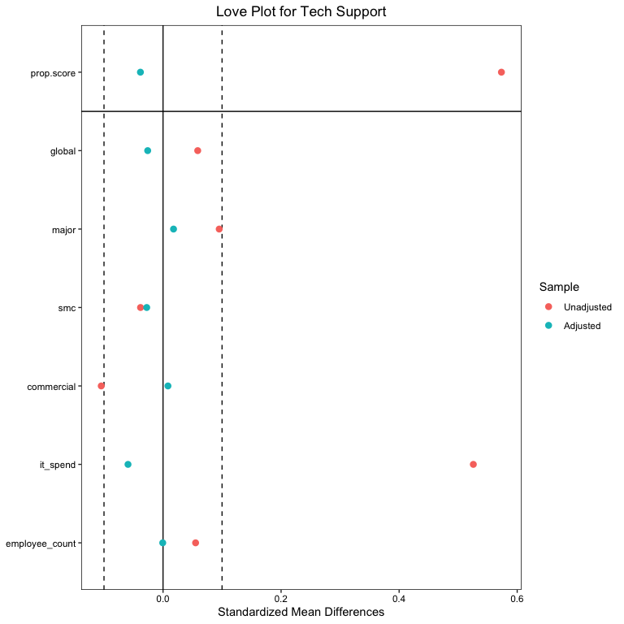<!-- -->

``` r
love.plot(
    weight2,
    binary = "std",
    thresholds = c(m = 0.1),
    title = "Love Plot for Discount")
```

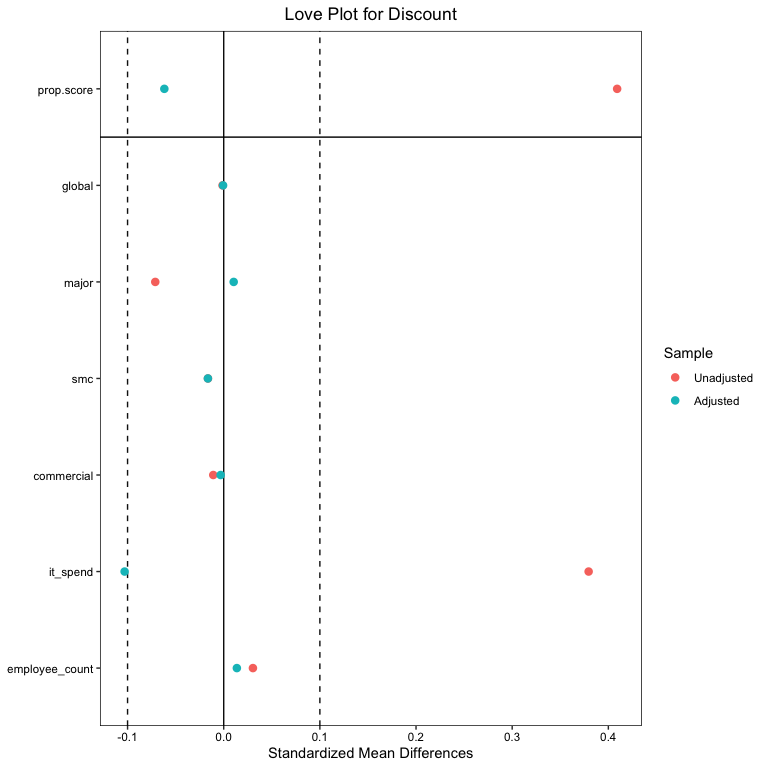<!-- -->

``` r
love.plot(
    weight3,
    binary = "std",
    thresholds = c(m = 0.1),
    title = "Love Plot for Tech Support and Discount")
```

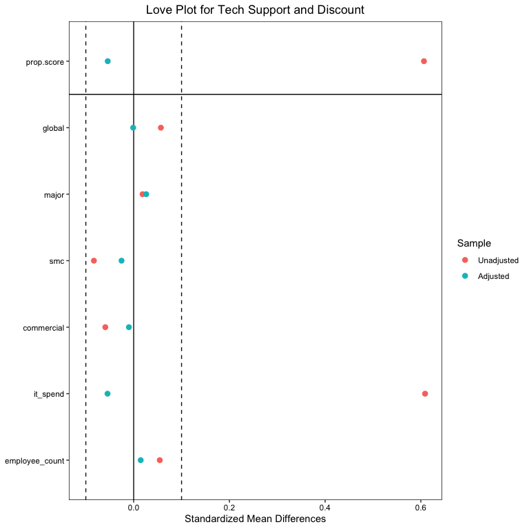<!-- -->

The groups appear to be well balanced.

Let’s create an alternate set of weighted groups to see if we can
improve the balance. We’ll remove employee_count and it_spend from the
covariates and add size and pc_count.

``` r
# recreate propensity scores with updated covariates (remove employee_count and it_spend -- adding size and pc_count)
weight1a <- weightit(treatment1 ~ global + major + smc + commercial + pc_count + size, data = df, method = "ps", estimand = "ate")

weight2a <- weightit(treatment2 ~ global + major + smc + commercial + pc_count + size, data = df, method = "ps", estimand = "ate")

weight3a <- weightit(treatment3 ~ global + major + smc + commercial + pc_count + size, data = df, method = "ps", estimand = "ate")
```

Creating balance tables for our new weighted groups. The values all seem
to fall within acceptable ranges.

``` r
# check balance using cobalt
print("New Balance Table for Tech Support")
```

    ## [1] "New Balance Table for Tech Support"

``` r
bal.tab(
    weight1a,
    data = df,
    binary = "std",
    disp.v.ratio = TRUE)
```

    ## Balance Measures
    ##                Type Diff.Adj V.Ratio.Adj
    ## prop.score Distance  -0.0084      0.9468
    ## global       Binary  -0.0117           .
    ## major        Binary   0.0139           .
    ## smc          Binary  -0.0176           .
    ## commercial   Binary  -0.0006           .
    ## pc_count    Contin.   0.0112      0.8929
    ## size        Contin.  -0.0095      0.9777
    ## 
    ## Effective sample sizes
    ##            Control Treated
    ## Unadjusted  994.   1006.  
    ## Adjusted    785.77  926.96

``` r
print("New Balance Table for Discount")
```

    ## [1] "New Balance Table for Discount"

``` r
bal.tab(
    weight2a,
    data = df,
    binary = "std",
    disp.v.ratio = TRUE)
```

    ## Balance Measures
    ##                Type Diff.Adj V.Ratio.Adj
    ## prop.score Distance  -0.0350      0.9024
    ## global       Binary   0.0099           .
    ## major        Binary   0.0078           .
    ## smc          Binary  -0.0062           .
    ## commercial   Binary  -0.0078           .
    ## pc_count    Contin.   0.0188      1.0350
    ## size        Contin.  -0.0640      0.7089
    ## 
    ## Effective sample sizes
    ##            Control Treated
    ## Unadjusted  979.   1021.  
    ## Adjusted    777.16  972.33

``` r
print("New Balance Table for Tech Support and Discount")
```

    ## [1] "New Balance Table for Tech Support and Discount"

``` r
bal.tab(
    weight3a,
    data = df,
    binary = "std",
    disp.v.ratio = TRUE)
```

    ## Balance Measures
    ##                Type Diff.Adj V.Ratio.Adj
    ## prop.score Distance  -0.0502      0.7224
    ## global       Binary   0.0004           .
    ## major        Binary   0.0326           .
    ## smc          Binary  -0.0043           .
    ## commercial   Binary  -0.0295           .
    ## pc_count    Contin.   0.0200      0.9467
    ## size        Contin.  -0.0599      0.6247
    ## 
    ## Effective sample sizes
    ##            Control Treated
    ## Unadjusted 1456.    544.  
    ## Adjusted   1040.19  437.07

Visualize the balance of the adjusted vs unadjusted groups for the
alternative weights.

``` r
# visualize the balance
love.plot(
    weight1a,
    binary = "std",
    thresholds = c(m = 0.1),
    title = "New Love Plot for Tech Support")
```

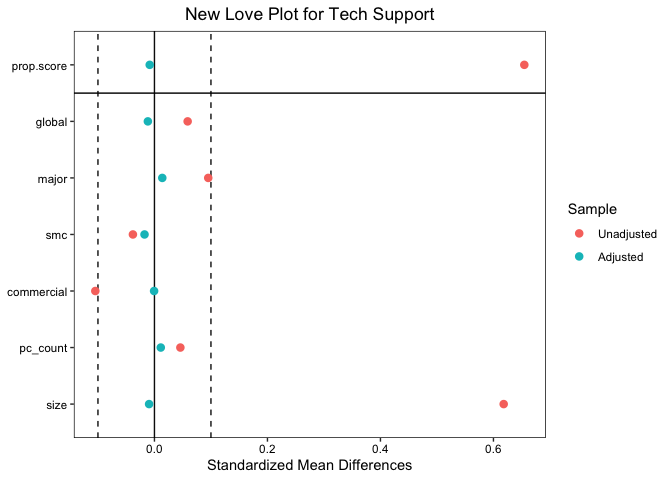<!-- -->

``` r
love.plot(
    weight2a,
    binary = "std",
    thresholds = c(m = 0.1),
    title = "New Love Plot for Discount")
```

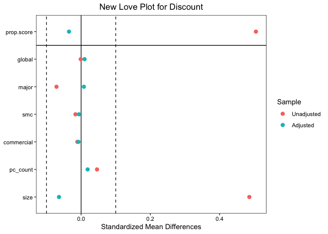<!-- -->

``` r
love.plot(
    weight3a,
    binary = "std",
    thresholds = c(m = 0.1),
    title = "New Love Plot for Tech Support and Discount")
```

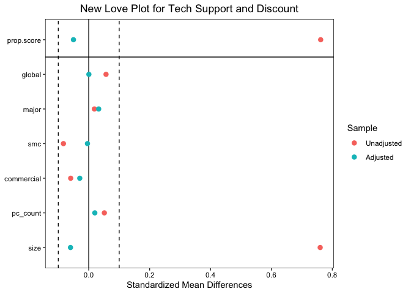<!-- -->

Creating balance plots for our original weights.

``` r
# Balance plot of propensity scores before and after weighting
bal.plot(
    weight1,
    var.name = "prop.score",
    which = "both"
)
```

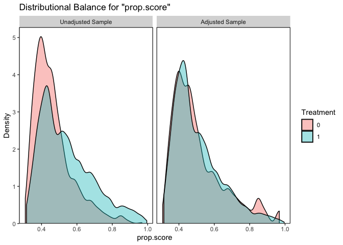<!-- -->

``` r
bal.plot(
    weight2,
    var.name = "prop.score",
    which = "both"
)
```

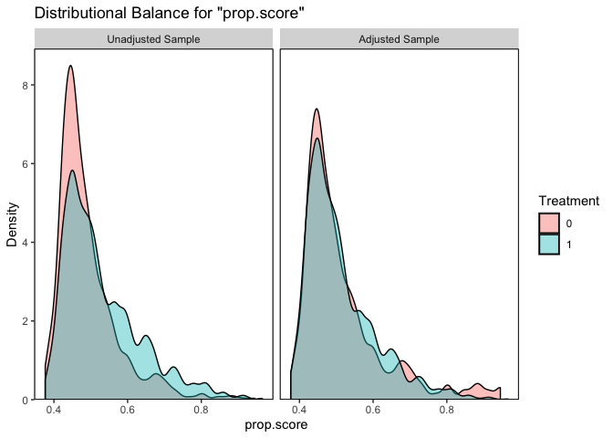<!-- -->

``` r
bal.plot(
    weight3,
    var.name = "prop.score",
    which = "both"
)
```

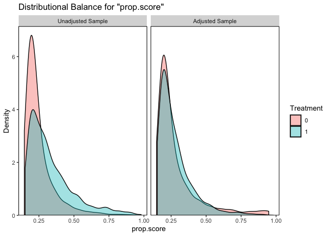<!-- -->

Creating balance plots for our new weights.

``` r
# Balance plot of propensity scores before and after weighting of updated weights
bal.plot(
    weight1a,
    var.name = "prop.score",
    which = "both"
)
```

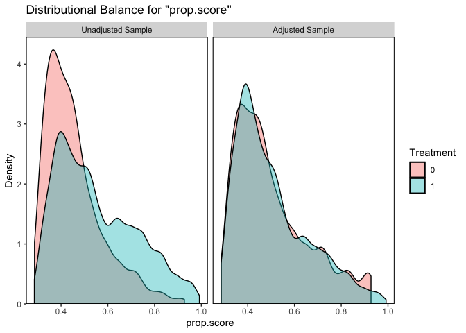<!-- -->

``` r
bal.plot(
    weight2a,
    var.name = "prop.score",
    which = "both"
)
```

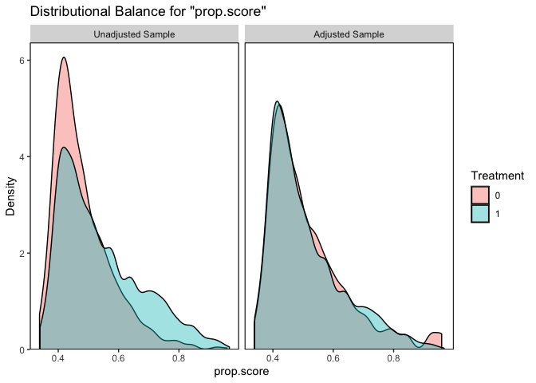<!-- -->

``` r
bal.plot(
    weight3a,
    var.name = "prop.score",
    which = "both"
)
```

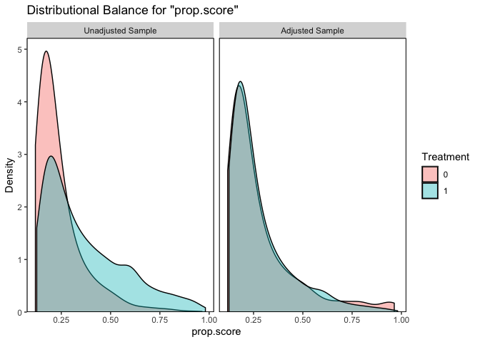<!-- -->

Both groups appear to be well balanced. We will continue with a weighted
generalized regression model using our new weights which allows for
non-normal distributions.

``` r
# weighted regression for treatment 1
model1a <- glm(outcome ~ treatment1 + global + major + smc + commercial + pc_count + size, data = df, weights = weight1a$weights)
summary(model1a)
```

    ## 
    ## Call:
    ## glm(formula = outcome ~ treatment1 + global + major + smc + commercial + 
    ##     pc_count + size, data = df, weights = weight1a$weights)
    ## 
    ## Deviance Residuals: 
    ##    Min      1Q  Median      3Q     Max  
    ## -69142   -2429    1342    3385   14614  
    ## 
    ## Coefficients:
    ##               Estimate Std. Error t value Pr(>|t|)    
    ## (Intercept) -2.193e+03  2.453e+02  -8.937  < 2e-16 ***
    ## treatment1   7.143e+03  1.617e+02  44.182  < 2e-16 ***
    ## global       3.801e+03  2.002e+02  18.989  < 2e-16 ***
    ## major        1.485e+03  2.371e+02   6.261 4.67e-10 ***
    ## smc         -3.810e+01  1.860e+02  -0.205    0.838    
    ## commercial   1.252e+03  1.748e+02   7.160 1.13e-12 ***
    ## pc_count     4.658e+01  1.522e+00  30.610  < 2e-16 ***
    ## size         8.088e-02  8.009e-04 100.993  < 2e-16 ***
    ## ---
    ## Signif. codes:  0 '***' 0.001 '**' 0.01 '*' 0.05 '.' 0.1 ' ' 1
    ## 
    ## (Dispersion parameter for gaussian family taken to be 26167896)
    ## 
    ##     Null deviance: 4.0986e+11  on 1999  degrees of freedom
    ## Residual deviance: 5.2126e+10  on 1992  degrees of freedom
    ## AIC: 38562
    ## 
    ## Number of Fisher Scoring iterations: 2

``` r
# robust standard errors
coeftest(model1a, vcov = vcovHC(model1a, type = "HC3"))
```

    ## 
    ## z test of coefficients:
    ## 
    ##                Estimate  Std. Error z value  Pr(>|z|)    
    ## (Intercept) -2.1925e+03  2.3403e+02 -9.3684 < 2.2e-16 ***
    ## treatment1   7.1432e+03  2.0794e+02 34.3530 < 2.2e-16 ***
    ## global       3.8012e+03  3.4902e+02 10.8910 < 2.2e-16 ***
    ## major        1.4847e+03  2.4652e+02  6.0227 1.715e-09 ***
    ## smc         -3.8102e+01  2.3041e+02 -0.1654    0.8687    
    ## commercial   1.2516e+03  2.7034e+02  4.6298 3.661e-06 ***
    ## pc_count     4.6578e+01  1.5836e+00 29.4122 < 2.2e-16 ***
    ## size         8.0883e-02  2.3683e-03 34.1528 < 2.2e-16 ***
    ## ---
    ## Signif. codes:  0 '***' 0.001 '**' 0.01 '*' 0.05 '.' 0.1 ' ' 1

``` r
# weighted regression for treatment 2
model2a <- glm(outcome ~ treatment2 + global + major + smc + commercial + pc_count + size, data = df, weights = weight2a$weights)
summary(model2a)
```

    ## 
    ## Call:
    ## glm(formula = outcome ~ treatment2 + global + major + smc + commercial + 
    ##     pc_count + size, data = df, weights = weight2a$weights)
    ## 
    ## Deviance Residuals: 
    ##    Min      1Q  Median      3Q     Max  
    ## -55256   -4481     731    5509   18745  
    ## 
    ## Coefficients:
    ##               Estimate Std. Error t value Pr(>|t|)    
    ## (Intercept) -1.506e+03  2.996e+02  -5.027 5.43e-07 ***
    ## treatment2   5.692e+03  1.965e+02  28.976  < 2e-16 ***
    ## global       4.328e+03  2.465e+02  17.553  < 2e-16 ***
    ## major        2.547e+03  2.860e+02   8.907  < 2e-16 ***
    ## smc          3.394e+02  2.272e+02   1.494  0.13526    
    ## commercial   5.850e+02  2.130e+02   2.746  0.00609 ** 
    ## pc_count     4.879e+01  1.905e+00  25.604  < 2e-16 ***
    ## size         7.619e-02  8.923e-04  85.393  < 2e-16 ***
    ## ---
    ## Signif. codes:  0 '***' 0.001 '**' 0.01 '*' 0.05 '.' 0.1 ' ' 1
    ## 
    ## (Dispersion parameter for gaussian family taken to be 38719760)
    ## 
    ##     Null deviance: 4.2393e+11  on 1999  degrees of freedom
    ## Residual deviance: 7.7130e+10  on 1992  degrees of freedom
    ## AIC: 39305
    ## 
    ## Number of Fisher Scoring iterations: 2

``` r
# robust standard errors
coeftest(model2a, vcov = vcovHC(model2a, type = "HC3"))
```

    ## 
    ## z test of coefficients:
    ## 
    ##                Estimate  Std. Error z value  Pr(>|z|)    
    ## (Intercept) -1.5061e+03  3.3895e+02 -4.4434 8.857e-06 ***
    ## treatment2   5.6924e+03  2.4955e+02 22.8109 < 2.2e-16 ***
    ## global       4.3277e+03  2.9991e+02 14.4300 < 2.2e-16 ***
    ## major        2.5475e+03  3.7490e+02  6.7951 1.082e-11 ***
    ## smc          3.3945e+02  3.4575e+02  0.9818   0.32621    
    ## commercial   5.8505e+02  2.6072e+02  2.2440   0.02483 *  
    ## pc_count     4.8789e+01  2.2203e+00 21.9741 < 2.2e-16 ***
    ## size         7.6192e-02  4.2070e-03 18.1106 < 2.2e-16 ***
    ## ---
    ## Signif. codes:  0 '***' 0.001 '**' 0.01 '*' 0.05 '.' 0.1 ' ' 1

``` r
# weighted regression for treatment 3
model3a <- glm(outcome ~ treatment3 + global + major + smc + commercial + pc_count + size, data = df, weights = weight3a$weights)
summary(model3a)
```

    ## 
    ## Call:
    ## glm(formula = outcome ~ treatment3 + global + major + smc + commercial + 
    ##     pc_count + size, data = df, weights = weight3a$weights)
    ## 
    ## Deviance Residuals: 
    ##    Min      1Q  Median      3Q     Max  
    ## -63027   -1593     976    3328   15390  
    ## 
    ## Coefficients:
    ##               Estimate Std. Error t value Pr(>|t|)    
    ## (Intercept) -9.125e+02  2.179e+02  -4.187 2.94e-05 ***
    ## treatment3   8.485e+03  1.438e+02  59.006  < 2e-16 ***
    ## global       4.108e+03  1.798e+02  22.844  < 2e-16 ***
    ## major        2.135e+03  2.093e+02  10.203  < 2e-16 ***
    ## smc          3.423e+02  1.664e+02   2.057   0.0398 *  
    ## commercial   8.507e+02  1.558e+02   5.459 5.38e-08 ***
    ## pc_count     4.732e+01  1.388e+00  34.098  < 2e-16 ***
    ## size         7.620e-02  6.423e-04 118.646  < 2e-16 ***
    ## ---
    ## Signif. codes:  0 '***' 0.001 '**' 0.01 '*' 0.05 '.' 0.1 ' ' 1
    ## 
    ## (Dispersion parameter for gaussian family taken to be 20663848)
    ## 
    ##     Null deviance: 4.3197e+11  on 1999  degrees of freedom
    ## Residual deviance: 4.1162e+10  on 1992  degrees of freedom
    ## AIC: 38323
    ## 
    ## Number of Fisher Scoring iterations: 2

``` r
# robust standard errors
coeftest(model3a, vcov = vcovHC(model3a, type = "HC3"))
```

    ## 
    ## z test of coefficients:
    ## 
    ##                Estimate  Std. Error z value  Pr(>|z|)    
    ## (Intercept) -9.1252e+02  2.8307e+02 -3.2237  0.001266 ** 
    ## treatment3   8.4845e+03  2.2955e+02 36.9610 < 2.2e-16 ***
    ## global       4.1078e+03  2.5201e+02 16.2996 < 2.2e-16 ***
    ## major        2.1351e+03  3.3121e+02  6.4464 1.145e-10 ***
    ## smc          3.4232e+02  3.2790e+02  1.0440  0.296505    
    ## commercial   8.5066e+02  2.1157e+02  4.0207 5.804e-05 ***
    ## pc_count     4.7323e+01  2.0426e+00 23.1673 < 2.2e-16 ***
    ## size         7.6202e-02  4.6964e-03 16.2257 < 2.2e-16 ***
    ## ---
    ## Signif. codes:  0 '***' 0.001 '**' 0.01 '*' 0.05 '.' 0.1 ' ' 1

## Interpretation

### Treatment 1 - Tech Support

Our model predicts that when tech support is provided, an increase in
revenue of approximately \$7,143 is expected with a standard error of
about \$208.

While holding all other variables constant, companies that have global
offices create addition revenue of approximately \$3,801. Similarly,
companies that are large consumers in their industry (major) and
companies that are classified as “commercial” create additional revenue
of approximately \$1,485 and \$1,252 respectively.

The number of computers a company has can also be used to predict
additional revenue. Every computer a company has can potentially
generate an additional \$47 in revenue.

### Treatment 2 - Discount

Our model predicts that when a discount is provided, an increase in
revenue of approximately \$5,692 is expected with a standard error of
about \$250.

While holding all other variables constant, companies that have global
offices create addition revenue of approximately \$4,328. Similarly,
companies that are large consumers in their industry (major) and
companies that are classified as “commercial” create additional revenue
of approximately \$2,547 and \$585 respectively.

The number of computers a company has can also be used to predict
additional revenue. Every computer a company has can potentially
generate an additional \$49 in revenue.

### Treatment 3 - Tech Support and Discount

Our model predicts that when tech support AND a discount is provided, an
increase in revenue of approximately \$8,485 is expected with a standard
error of about \$230.

While holding all other variables constant, companies that have global
offices create addition revenue of approximately \$4,108. Similarly,
companies that are large consumers in their industry (major) and
companies that are classified as “commercial” create additional revenue
of approximately \$2,135 and \$851 respectively.

The number of computers a company has can also be used to predict
additional revenue. Every computer a company has can potentially
generate an additional \$47 in revenue.

While all 3 treatments are likely to created additional revenue,
combining both tech support and a discount will likely create more.
However, the benefit of providing a discount on top of tech support is
only around \$1,342 and so the costs of providing tech support and a
discount should be taken into account to ensure that revenue is being
maximized.

The company’s profile should also be taken into account as companies
with global offices, who are large consumers in their industry, who are
classified as “commercial” and have a large number of computers will
also affect their revenue in a positive way.

## Further Considerations

The costs of providing tech support and the amount of discount provided
are not known. These costs should be further investigated to ensure that
revenue is being maximized.
